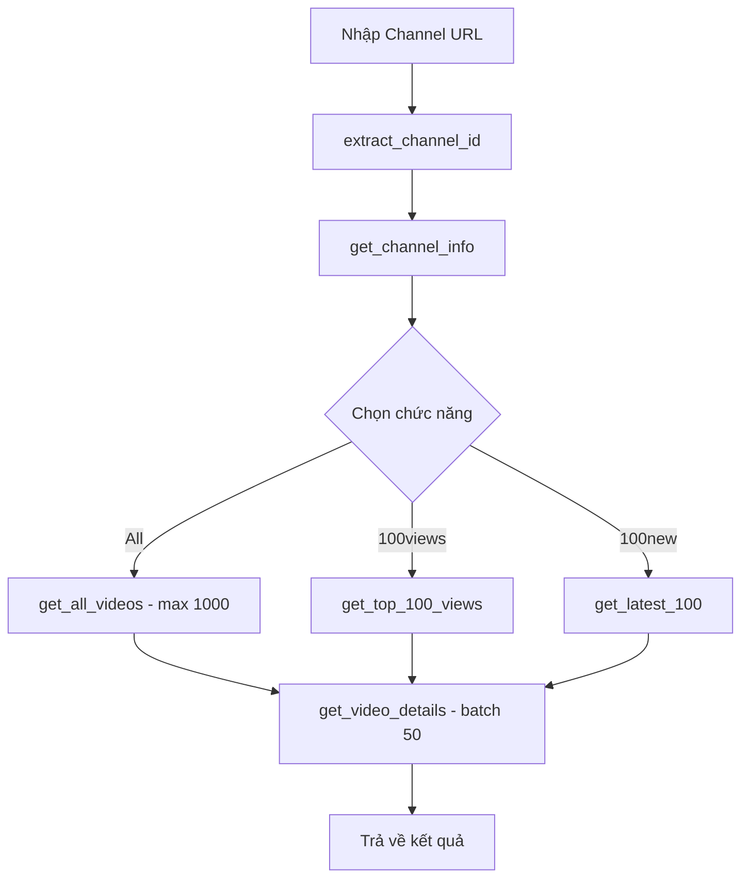

# YouTube Statistic Desktop App

Ứng dụng desktop Python sử dụng YouTube Data API v3 để lấy thông tin video từ một channel YouTube, xuất ra file JSON và CSV.

## Tổng quan yêu cầu

| Hạng mục | Chi tiết |
|---|---|
| **Ngôn ngữ** | Python 3 |
| **GUI** | Tkinter (light mode, tiếng Việt) |
| **API** | YouTube Data API v3 |
| **Thư viện ngoài** | `requests` |
| **Output** | JSON + CSV theo template có sẵn |

---

## Proposed Changes

### 1. Core Module — YouTube API

#### [NEW] [youtube_api.py](file:///d:/workspace/vibe-code-app/youtube-statistic/youtube_api.py)

Module xử lý toàn bộ tương tác với YouTube Data API v3.

**Các hàm chính:**

| Hàm | Mô tả |
|---|---|
| `validate_api_key(api_key)` | Kiểm tra API key có hợp lệ không bằng cách gọi thử API |
| `extract_channel_id(channel_url)` | Trích xuất channel ID từ nhiều dạng URL (`/channel/`, `/@handle`, `/c/`, `/user/`) |
| `get_channel_info(api_key, channel_id)` | Lấy thông tin channel: tên, link, subscriber, tổng số video |
| `get_all_videos(api_key, channel_id, callback)` | Lấy tất cả video (tối đa 1000), gọi `callback` để cập nhật progress |
| `get_top_100_views(api_key, channel_id, callback)` | Lấy tất cả video → sort theo view → trả về top 100 |
| `get_latest_100(api_key, channel_id, callback)` | Lấy 100 video mới nhất (sort theo ngày đăng) |
| `get_video_details(api_key, video_ids)` | Lấy chi tiết video (view, duration) — batch 50 video/request |

**Luồng hoạt động gọi API:**



**Chi tiết API calls & Quota:**

- **Search endpoint** (`search.list`): 100 quota/request, trả về max 50 results/page
  - All (1000 video): ~20 pages × 100 = **2000 quota**
  - 100new: ~2 pages × 100 = **200 quota**
- **Videos endpoint** (`videos.list`): 1 quota/request, batch 50 video/request
  - 1000 video: 20 requests × 1 = **20 quota**
  - 100 video: 2 requests × 1 = **2 quota**
- **Channels endpoint** (`channels.list`): 1 quota/request = **1 quota**

> [!NOTE]
> YouTube Data API v3 có giới hạn **10,000 quota/ngày** (miễn phí). Chức năng "All" với 1000 video sẽ tốn ~2021 quota, cho phép chạy ~4 lần/ngày. Chức năng "100new" và "100views" tốn ít hơn nhiều.

**Xử lý lỗi:**

| Lỗi | Cách xử lý |
|---|---|
| API key không hợp lệ | Gọi thử API, trả lỗi rõ ràng |
| Channel URL không hợp lệ | Validate format URL trước khi gọi API |
| Channel không tồn tại | Kiểm tra response từ API |
| Quota hết | Bắt HTTP 403 + reason `quotaExceeded` |
| Mất mạng | Bắt `requests.ConnectionError` |

---

### 2. File Handler Module

#### [NEW] [file_handler.py](file:///d:/workspace/vibe-code-app/youtube-statistic/file_handler.py)

Module xử lý xuất file JSON và CSV.

**Các hàm chính:**

| Hàm | Mô tả |
|---|---|
| `generate_filename(channel_name, mode, output_dir)` | Tạo tên file: `Ten-Kenh_all.json`. Nếu trùng → `Ten-Kenh_all_v1.json`, `_v2`... |
| `save_json(data, filepath)` | Lưu dữ liệu ra file JSON theo template |
| `convert_json_to_csv(json_filepath, csv_filepath)` | Đọc JSON → xuất CSV, mỗi row = 1 video + thông tin channel lặp lại |
| `sanitize_channel_name(name)` | Thay khoảng trắng bằng `-`, bỏ ký tự đặc biệt |

**Format output JSON** (theo [output_json_template.json](file:///d:/workspace/vibe-code-app/youtube-statistic/output_json_template.json)):

```json
{
    "channel_name": "Tên kênh",
    "channel_link": "link channel",
    "subcriber": "số subscriber",
    "video_num": "tổng số video",
    "videos_list": [
        {
            "title": "Tiêu đề",
            "view_count": "số view",
            "published_at": "dd/MM/yyyy",
            "duration": "giây",
            "video_link": "link video"
        }
    ]
}
```

**Format output CSV** (theo [output_csv_template.csv](file:///d:/workspace/vibe-code-app/youtube-statistic/output_csv_template.csv)):

| channel_name | channel_link | subcriber | video_num | videos_list | title | view_count | published_at | duration | video_link |
|---|---|---|---|---|---|---|---|---|---|
| Tên kênh | link | 1000 | 50 | (trống) | Video 1 | 5000 | 01/01/2025 | 300 | link |
| Tên kênh | link | 1000 | 50 | (trống) | Video 2 | 3000 | 02/01/2025 | 450 | link |

> [!IMPORTANT]
> Cột `videos_list` trong CSV sẽ để **trống** vì dữ liệu video đã được flatten ra các cột riêng. Giữ cột này để đúng template.

**Logic đặt tên file versioning:**

```
Lần 1: chien_all.json / chien_all.csv
Lần 2: chien_all_v1.json / chien_all_v1.csv
Lần 3: chien_all_v2.json / chien_all_v2.csv
```

---

### 3. GUI Module — Tkinter

#### [NEW] [main.py](file:///d:/workspace/vibe-code-app/youtube-statistic/main.py)

Giao diện chính của ứng dụng, sử dụng `tkinter` + `tkinter.ttk`.

**Layout giao diện:**

```
┌──────────────────────────────────────────────┐
│          📊 YouTube Statistic Tool           │
├──────────────────────────────────────────────┤
│                                              │
│  🔑 YouTube API Key:                         │
│  ┌────────────────────────────┐ [👁 Hiện]    │
│  │ ****************************│              │
│  └────────────────────────────┘              │
│                                              │
│  🔗 Link Channel YouTube:                    │
│  ┌────────────────────────────────────────┐  │
│  │ https://youtube.com/@channel            │  │
│  └────────────────────────────────────────┘  │
│                                              │
│  📁 Thư mục lưu file:                       │
│  ┌──────────────────────────┐ [Chọn...]     │
│  │ D:/output                │               │
│  └──────────────────────────┘               │
│                                              │
│  ⚙️ Chức năng:                               │
│  ┌─────────────────────────────────────┐     │
│  │ ○ All (tối đa 1000 video)           │     │
│  │ ○ 100 video mới nhất (100new)       │     │
│  │ ○ 100 video nhiều view nhất (100views)│    │
│  └─────────────────────────────────────┘     │
│                                              │
│  ┌──────────────────────────────────────┐    │
│  │          ▶ BẮT ĐẦU LẤY DỮ LIỆU      │    │
│  └──────────────────────────────────────┘    │
│                                              │
│  Tiến trình: ████████████░░░░░░ 65%          │
│  Trạng thái: Đang lấy video 650/1000...     │
│                                              │
└──────────────────────────────────────────────┘
```

**Các thành phần GUI:**

| Thành phần | Widget | Mô tả |
|---|---|---|
| API Key | `ttk.Entry` (show="*") + nút toggle hiện/ẩn | Nhập API key, ẩn mặc định |
| Channel URL | `ttk.Entry` | Nhập link channel |
| Output folder | `ttk.Entry` + `ttk.Button` | Chọn thư mục bằng `filedialog` |
| Chức năng | `ttk.Radiobutton` × 3 | All / 100new / 100views |
| Nút bắt đầu | `ttk.Button` | Kích hoạt lấy dữ liệu |
| Progress bar | `ttk.Progressbar` | Hiển thị tiến trình |
| Status label | `ttk.Label` | Hiển thị trạng thái hiện tại |

**Xử lý bất đồng bộ:**

- Sử dụng `threading.Thread` để chạy API calls trên background thread
- GUI thread (main thread) vẫn responsive, cập nhật progress bar qua `root.after()`
- Nút "Bắt đầu" bị disable khi đang chạy, enable lại khi xong

**Lưu/đọc API key:**

- File `config.json` cùng thư mục app
- Khi mở app: tự động load API key từ config (nếu có)
- Khi nhấn "Bắt đầu": tự động save API key vào config

---

### 4. Config File

#### [NEW] [config.json](file:///d:/workspace/vibe-code-app/youtube-statistic/config.json)

```json
{
    "api_key": "YOUR_API_KEY_HERE"
}
```

File này được tự động tạo/cập nhật khi người dùng nhập API key.

---

### 5. Documentation

#### [NEW] [README.md](file:///d:/workspace/vibe-code-app/youtube-statistic/README.md)

Nội dung bao gồm:
- Giới thiệu ứng dụng
- Yêu cầu hệ thống (Python 3.7+, pip)
- **Hướng dẫn lấy YouTube API Key** (từng bước, có ảnh minh họa link)
  1. Truy cập Google Cloud Console
  2. Tạo Project mới
  3. Bật YouTube Data API v3
  4. Tạo API Key trong Credentials
- Cài đặt dependencies (`pip install requests`)
- Hướng dẫn sử dụng app
- Giải thích 3 chức năng
- Giới hạn quota API

---

## Verification Plan

### Automated Tests
- Chạy `python main.py` để verify app khởi động thành công
- Kiểm tra giao diện hiển thị đúng layout

### Manual Verification
- Yêu cầu bạn test với API key thật và 1 channel YouTube
- Kiểm tra file JSON/CSV output đúng format template
